<!--
<a href="https://github-readme-stats.vercel.app/api?username=hedzr&count_private=true&line_height=32&role=owner,collaborator&show=reviews,discussions_answered&show_icons=true&theme=github_dark_dimmed"></a>
<a href="https://github-readme-stats.vercel.app/api/top-langs/?username=hedzr&layout=compact&role=owner,collaborator&langs_count=12&hide=nix,javascript,c%23,css,scss,html&exclude_repo=jikan,1blu-svelte-mail-setup,mail-setup-euromet,spawn,vaultage,dots,nxvim,vuexy-vuejs-admin-template,vuexy-nuxtjs-admin-template&theme=github_dark_dimmed"></a>
-->

<!-- 
<div>
  
  

</div>
-->

<div>
  Blog: https://hedzr.com
  
  Docs: https://docs.hedzr.com
</div>

<div><!--
<picture>
  <source
    srcset="https://github-readme-stats.vercel.app/api?username=hedzr&hide=contribs&show_icons=true&border=none&theme=codeSTACKr"
    media="(prefers-color-scheme: dark), (prefers-color-scheme: no-preference)"
  />
  <source
    srcset="https://github-readme-stats.vercel.app/api?username=hedzr&hide=contribs&show_icons=true&border=none"
    media="(prefers-color-scheme: light)"
  />
  
  
</picture>
  -->

  <!-- archived at 2026-03-03
  
  
  
  -->

  
  
  <!--  -->

</div><div style="clear: both"></div>

<details>
<summary>Hi, Leo _</summary>

<div>
  
  - 👋 Hi, I’m @hedzr
  - 👀 I’m interested in constructing the world with PL
  - 🌱 I’m currently learning ..., I'd learned long time, and I'll last it
  - 💞️ I’m looking to collaborate on ...
  - 📫 How to reach me : [my blog](https://hedzr.com/), mail me or t me

</div>

<!-- [](https://github.com/hedzr)
-->

<!--
   [](https://github.com/hedzr)
-->

<!--
[](https://github.com/hedzr)
-->

<!---
hedzr/hedzr is a ✨ special ✨ repository because its `README.md` (this file) appears on your GitHub profile.
You can click the Preview link to take a look at your changes.
--->

```typecript
const hedzr = {
  code: [
      "Ask-Lang",
      "C++", "Golang", "Rust", "Zig", "C#", "Kotlin",
      "Shell",
      "TypeScript", "React", "NextJS", 
      "Python", "Javascript", "Java",
  ],
  askMeAbout: [
      "Architecture", "Compiler dev", "System dev",
      "Backend dev", "DevOps", "UI/UX", "sys admin",
  ],
  technologies: {
    ml: [
      "Pytorch",
      "Tensorflow",
      "Scikitlearn",
      "Pandas",
      "Polars",
      "Numba",
      "Numpy",
      "Cupy",
      "Dask",
    ],
    frontEnd: {
      js: ["React", "Next.js", "Svelte/Sveltekit"],
      css: ["Tailwind"],
      uiLibraries: ["Material UI", "Ant Design", "Skeleton"],
    },
    backEnd: {
      js: ["Node", "Express", "NestJS"],
      python: ["Flask", "FastAPI"],
      rust: ["Axum"],
    },
    devOps: ["Ansible", "Docker🐳", "CI/CD", "Nginx", "GitHub Actions", "Caddy", "Pulumi"],
    cloudServices: {
      aws: ["AWS Beanstalk", "EC2", "S3", "RDS"],
      gcp: ["App Engine", "Compute Engine", "GKE", "GCS"],
    },
    databases: ["PostgreSQL", "SQLite", "redis", "MongoDB"],
    misc: ["Socket.IO", "REST APIs", "WebSockets"],
  },
};
```

</detail>
